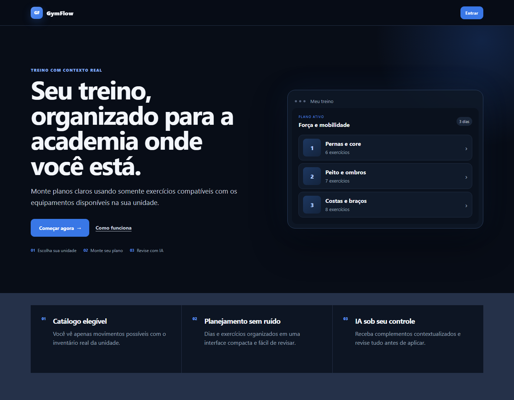
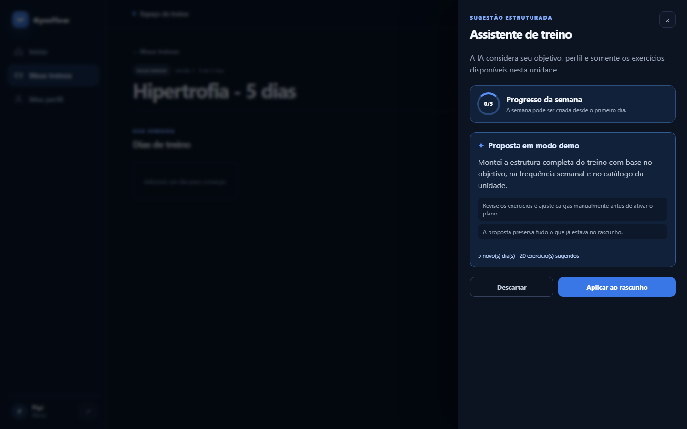
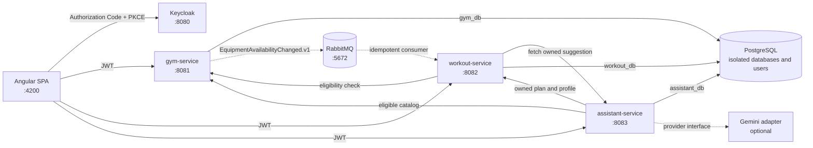

# GymFlow

[](https://github.com/PietraAC/GymFlow/actions/workflows/ci.yml)


GymFlow is a portfolio project for building weekly workout plans around the equipment that is actually available at a selected gym branch.

Gym administrators manage gyms, branches, and equipment inventory. Students create plans from the eligible exercise catalog, organize training days, and may ask an AI assistant to propose the missing parts of a week. Every proposal is shown for review before it can be applied, and the workout service independently validates ownership, version, structure, and current eligibility.

> GymFlow is educational software, not medical guidance. The catalog uses neutral exercise descriptions and does not diagnose conditions, prescribe treatment, or define loads for the student.





## What is implemented

| Area | Current behavior |
| --- | --- |
| Gym management | Gym, branch, equipment inventory, exercise catalog, and branch eligibility management |
| Student profile | Goal, experience, weekly frequency, session duration, and preferred equipment |
| Workout planning | Two-step plan creation, day organization, eligible exercise selection, sets, repetitions, duration, rest, notes, and optional user load |
| Exercise media | Visible GIF placeholders in the catalog, compact rows, and expanded details; files can be added later without changing templates |
| Authentication | Keycloak OIDC using Authorization Code + PKCE S256 |
| Authorization | Realm roles, gym-admin isolation, student ownership, and non-leaking `404` responses |
| AI assistant | Deterministic offline adapter and optional Gemini adapter behind the same provider interface |
| AI review | Suggestions remain separate until the student explicitly reviews and applies them |
| Inventory events | RabbitMQ `EquipmentAvailabilityChanged.v1` event using an outbox and idempotent consumer |
| Reliability | Flyway migrations, optimistic locking, Problem Details, timeouts, correlation IDs, health checks, and metrics |
| Verification | Backend tests, Angular unit tests, production build, and a real authenticated Chromium journey in GitHub Actions |

The public interface uses a dark-blue and neutral visual system. Desktop navigation uses a compact sidebar and maps to bottom navigation at mobile widths. A dedicated public `/como-funciona` page explains the complete user flow.

## Architecture



Each service owns its database credentials, schema, Flyway migrations, and domain model. Services do not access another service's database and never share JPA entities.

| Service | Responsibility |
| --- | --- |
| `gym-service` | Gyms, admin memberships, branches, equipment inventory, exercise catalog, eligibility, outbox publication, and metrics |
| `workout-service` | Student profiles, workout aggregates, activation rules, suggestion application, inventory-event consumption, and metrics |
| `assistant-service` | Context snapshots, expiring proposals, provider adapters, output validation, rate/concurrency limits, and metrics |
| `frontend` | Public presentation, role-aware navigation, administration, profiles, workout planning, media placeholders, and proposal review |

More detail is available in [docs/architecture.md](docs/architecture.md), the [ADR index](docs/adr/README.md), and [docs/implementation-plan.md](docs/implementation-plan.md).

## AI proposal flow

1. The student opens the assistant from a draft.
2. The frontend saves the current draft.
3. `assistant-service` fetches the owned plan/profile and the eligible branch catalog.
4. The selected provider returns schema-constrained JSON using only eligible exercise IDs.
5. `assistant-service` validates and stores an expiring proposal.
6. The frontend presents the proposal in a review drawer. Nothing is applied automatically.
7. After explicit confirmation, `workout-service` revalidates ownership, version, expiry, single use, structure, exercise kind, and current eligibility before applying it.

The result remains a draft. The assistant cannot activate a plan, delete existing content, write directly to a database, invent exercise IDs, or prescribe load in kilograms.

The default `demo` provider is deterministic and offline. Gemini is optional and configured only through environment variables. Automated tests never call a real AI provider.

## Exercise GIFs

Every exercise already reserves media space. To add a GIF, place an optimized 4:3 file at:

```text
frontend/public/exercises/<exercise-id>.gif
```

The shared Angular media component automatically uses the same file as a square list thumbnail and a larger 4:3 detail preview. If the file is absent, the designed placeholder remains visible. See [frontend/public/exercises/README.md](frontend/public/exercises/README.md).

## Quick start on Windows

### Prerequisites

- JDK 21
- Node.js 24.15 or another version supported by Angular 22.2
- Docker Desktop with Docker Compose v2

Create the ignored local environment file and replace every `change-me` value:

```powershell
Copy-Item .env.example .env
notepad .env
```

Start the complete environment with one command:

```powershell
.\start-gymflow.bat
```

The launcher starts Docker Desktop when necessary, brings up PostgreSQL, Keycloak, and RabbitMQ, builds the three Spring Boot services, restores frontend dependencies when needed, waits for health checks, and opens `http://localhost:4200`.

Stop all GymFlow processes and containers while preserving PostgreSQL data:

```powershell
.\stop-gymflow.bat
```

## Demo accounts

These credentials exist only in the reproducible local Keycloak realm and must not be reused elsewhere.

| User | Local password | Role | Purpose |
| --- | --- | --- | --- |
| `admin.aurora` | `gymflow-admin-a` | `GYM_ADMIN` | Manages Academia Aurora |
| `admin.movimento` | `gymflow-admin-b` | `GYM_ADMIN` | Manages Movimento Centro Fitness |
| `aluna.demo` | `gymflow-student-a` | `STUDENT` | Creates her own profile and plans |
| `aluno.demo` | `gymflow-student-b` | `STUDENT` | Demonstrates student isolation |

The demo catalog contains two gyms, three branches, ten equipment types, and 22 neutral exercises.

## Local endpoints

| Component | URL |
| --- | --- |
| Angular application | `http://localhost:4200` |
| How it works | `http://localhost:4200/como-funciona` |
| Keycloak | `http://localhost:8080` |
| RabbitMQ management | `http://localhost:15672` |
| Gym API / Swagger UI | `http://localhost:8081/swagger-ui.html` |
| Workout API / Swagger UI | `http://localhost:8082/swagger-ui.html` |
| Assistant API / Swagger UI | `http://localhost:8083/swagger-ui.html` |

Versioned contracts: [Gym API](docs/openapi/gym-service.yaml), [Workout API](docs/openapi/workout-service.yaml), [Assistant API](docs/openapi/assistant-service.yaml), and [`EquipmentAvailabilityChanged.v1`](docs/events/equipment-availability-changed-v1.schema.json).

## Verification

The GitHub Actions workflow has three jobs:

- `backend`: Java 21 and `./mvnw --batch-mode verify`.
- `frontend`: Node.js 24.15, clean npm install, Angular/Vitest tests, and production build.
- `browser`: complete local infrastructure, real Keycloak login, profile persistence, two-step draft creation, deterministic AI review, confirmed application, and exercise rendering in Chromium.

Equivalent local commands:

```powershell
.\mvnw.cmd verify

Set-Location frontend
npm.cmd ci
npm.cmd test
npm.cmd run build
npx.cmd playwright install chromium
npm.cmd run e2e
```

The browser journey uses fictional demo data and `AI_PROVIDER=demo`. It also verifies correctly encoded Portuguese assistant text before applying the proposal.

## Important domain and security decisions

- JWT issuer, audience, and realm roles are validated in every service.
- Student ownership always comes from the token `sub`; clients never submit a trusted student identifier.
- Active plans are immutable and must be complete and eligible before activation.
- Draft mutations fail closed if authoritative eligibility cannot be checked.
- Optimistic locking returns `409 Conflict` for stale updates.
- Suggestions expire, carry plan/context fingerprints, and can be applied only once.
- Provider calls have connection/read timeouts, bounded output, per-user limits, and global concurrency control.
- Inventory changes and outbox records commit together; RabbitMQ publication uses confirms and persistent messages.
- `.env`, build output, caches, logs, tokens, AI keys, and the private product specification are excluded from version control.
- Keycloak runs in development mode locally; this repository is not a production deployment template.

See [SECURITY.md](SECURITY.md), [docs/observability.md](docs/observability.md), and [docs/rabbitmq-operations.md](docs/rabbitmq-operations.md).

## Project structure

```text
GymFlow/
|-- services/
|   |-- gym-service/
|   |-- workout-service/
|   `-- assistant-service/
|-- frontend/
|-- infra/
|   |-- keycloak/
|   `-- postgres/
|-- docs/
|   |-- adr/
|   |-- assets/
|   |-- events/
|   `-- openapi/
|-- scripts/
|-- .github/workflows/
|-- compose.yml
|-- start-gymflow.bat
`-- stop-gymflow.bat
```

## Roadmap

Stages 1 through 6 are implemented: foundation and inventory, manual workouts, structured assistant, event-driven inventory updates, portfolio hardening, and complete-week proposals.

The next stage is production deployment readiness. It intentionally remains unimplemented until there is a concrete hosting target and threat model. That work includes TLS, production-mode Keycloak, managed secrets, backups, restricted management endpoints, external-provider privacy rules, quality evaluation, operational dashboards, and SLOs. A gateway, service discovery, and Kubernetes remain deferred until a real requirement justifies them.

Pinned versions and their official sources are documented in [docs/versions.md](docs/versions.md).
