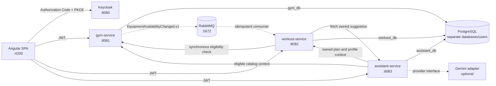

# GymFlow


[](https://github.com/PietraAC/GymFlow/actions/workflows/ci.yml)

GymFlow is a portfolio project that explores how to build a secure, evolvable fitness platform with Java, Spring Boot, Angular, PostgreSQL, and Keycloak.

Gyms manage branches and equipment availability. Students build weekly workout plans using only exercises that are eligible at their selected branch. With one explicit button, the contextual assistant can complete an empty or partial week with schema-constrained JSON that is revalidated and idempotently applied to the saved draft.

> This project is educational software, not medical guidance. Its exercise catalog contains neutral training descriptions and does not diagnose conditions or prescribe treatment.


## Current status

Stages 1 through 6 are complete. The repository includes authentication, authorization, persistence, inventory-aware eligibility, manual workout planning, full-week AI completion, RabbitMQ inventory events, observability, CI, and browser-level verification.

| Capability | Status |
| --- | --- |
| Gym, branch, equipment inventory, and exercise catalog management | Implemented |
| Exercise eligibility per branch | Implemented |
| Student profile and manual weekly workout plans | Implemented |
| OAuth 2.0 / OIDC login with Authorization Code + PKCE | Implemented |
| Role and ownership-based authorization | Implemented |
| AI-assisted completion of empty or partial weekly drafts | Implemented |
| RabbitMQ equipment availability event | Implemented |
| CI, Chromium end-to-end flow, metrics, ADRs, and demo material | Implemented |
| Cloud deployment, gateway, service discovery, and Kubernetes | Not in the current scope |

## Architecture



Each service owns its data and Flyway migrations. Services never access another service's database and do not share JPA entities. Cross-service references are stored as UUIDs and validated through APIs.

### Services

| Service | Responsibility | Current scope |
| --- | --- | --- |
| `gym-service` | Gyms, admin memberships, branches, equipment inventory, exercise catalog, eligibility, transactional event outbox, and operational metrics | Stages 1–6 |
| `workout-service` | Student profiles, workout aggregate, plan goal/frequency, idempotent completion application, inventory-event consumer, and operational metrics | Stages 2–6 |
| `assistant-service` | Context snapshots, expiring structured proposals, demo and Gemini providers, validation, rate/concurrency limits, and AI metrics | Stages 3, 5, and 6 |
| `frontend` | Role-aware administration, student workflows, expandable weekly editor, AI completion action, and browser verification | Stages 2–6 |

## Key technical decisions

- Java 21 and Spring Boot 3.5 with feature-oriented packages.
- Angular 22 standalone components, strict templates, signals, and reactive forms.
- OAuth 2.0 / OpenID Connect through Keycloak; the browser uses PKCE S256.
- JWT validation checks issuer, audience, and realm roles in every service.
- Student ownership always comes from the token `sub`; clients cannot submit a student ID.
- One PostgreSQL instance hosts isolated databases and users for local development.
- Flyway owns schema creation and reproducible demo data.
- The workout service revalidates exercises against the gym service before saving or activating a plan.
- Eligibility mutations fail closed on timeout or dependency failure; reads remain available with warnings.
- Optimistic locking prevents silent overwrites, returning `409 Conflict` for stale versions.
- APIs use RFC 9457-style `ProblemDetail` responses and correlation IDs.
- AI integration is behind `TrainingAssistantProvider`, with a deterministic offline demo adapter and no real provider calls in tests.
- Suggestions expire after 30 minutes, carry plan/context fingerprints, and are applied idempotently only by `workout-service`.
- Provider calls have explicit connection/read timeouts, bounded output, per-user rate limiting, global concurrency control, and no automatic generation retry.
- Inventory changes and outbox records commit together; publication uses persistent messages and broker confirms.
- The workout consumer is idempotent, ignores older aggregate versions, retries finitely, and dead-letters messages it cannot process.

### How the Gemini integration works

The browser never calls Gemini and never receives the API key. After the student saves a draft and explicitly asks to complete it, `assistant-service` fetches the owned plan/profile from `workout-service` and the eligible exercise catalog from `gym-service`. It sends Gemini only that bounded JSON context—goal, weekly frequency, existing draft, profile fields required for the workout, and eligible exercise IDs—and requests a response constrained to the workout-completion schema.

Gemini can propose new days and exercise additions, but it cannot write to a database, remove existing content, activate a plan, choose arbitrary exercise IDs, or define load in kilograms. `assistant-service` validates the response and stores an expiring proposal with its plan version and context fingerprint. `workout-service` then fetches that proposal server-to-server and independently checks ownership, version, expiry, single use, structure, exercise kind, and current branch eligibility before applying it. The result always remains a draft for human review.

For security and predictable failure behavior, `GEMINI_API_KEY` exists only in the ignored local `.env` (or a deployment secret manager), provider calls have timeouts, bounded output, per-user rate limiting and global concurrency control, and generation is never retried automatically. Invalid or unavailable AI output fails closed without a silent switch to the demo provider; manual editing stays available. Context and user-controlled text are explicitly treated as untrusted data, and credentials/provider payloads are not written to tracked files or application logs.

## Domain rules demonstrated

- Draft plans may be incomplete; active plans must be complete and currently eligible.
- Active plans are immutable and can be archived to preserve history.
- Strength exercises require sets and a repetition range; load is optional.
- Warm-up and stretching items use duration or a complete sets/repetitions scheme.
- Day and item positions are unique and preserve the student's intended order.
- Equipment availability is administrative inventory, not real-time occupancy.
- A student can never read or mutate another student's plans.

## Quick start on Windows

### Prerequisites

- JDK 21
- Node.js 24.15 or a compatible Angular 22 version
- Docker Desktop with Docker Compose v2

Copy the local environment template and replace every `change-me` value:

```powershell
Copy-Item .env.example .env
notepad .env
```

Then double-click [`start-gymflow.bat`](start-gymflow.bat), or run:

```powershell
.\start-gymflow.bat
```

The script starts Docker Desktop when needed, launches PostgreSQL, Keycloak, and RabbitMQ, builds all services, restores frontend dependencies when necessary, waits for every health check, and opens `http://localhost:4200`.

Stop the complete local environment without deleting PostgreSQL data:

```powershell
.\stop-gymflow.bat
```

### Demo accounts

These credentials belong exclusively to the reproducible local Keycloak realm and must never be reused elsewhere.

| User | Local password | Role | Purpose |
| --- | --- | --- | --- |
| `admin.aurora` | `gymflow-admin-a` | `GYM_ADMIN` | Manages Academia Aurora |
| `admin.movimento` | `gymflow-admin-b` | `GYM_ADMIN` | Manages Movimento Centro Fitness |
| `aluna.demo` | `gymflow-student-a` | `STUDENT` | Creates her own profile and plans |
| `aluno.demo` | `gymflow-student-b` | `STUDENT` | Demonstrates student isolation |

The demo catalog contains two gyms, three branches, ten equipment types, and 22 neutral exercises.

## Local endpoints

| Component | URL |
| --- | --- |
| Angular application | `http://localhost:4200` |
| Keycloak | `http://localhost:8080` |
| RabbitMQ management | `http://localhost:15672` |
| Gym API / Swagger UI | `http://localhost:8081/swagger-ui.html` |
| Workout API / Swagger UI | `http://localhost:8082/swagger-ui.html` |
| Assistant health check | `http://localhost:8083/actuator/health` |
| Assistant API / Swagger UI | `http://localhost:8083/swagger-ui.html` |

Versioned contracts: [Gym API](docs/openapi/gym-service.yaml), [Workout API](docs/openapi/workout-service.yaml), [Assistant API](docs/openapi/assistant-service.yaml), and [`EquipmentAvailabilityChanged.v1`](docs/events/equipment-availability-changed-v1.schema.json). See the expanded [architecture](docs/architecture.md), [architecture decisions](docs/adr/README.md), [observability guide](docs/observability.md), and [RabbitMQ operations runbook](docs/rabbitmq-operations.md).

## Running manually

Start the infrastructure:

```powershell
docker compose up -d
docker compose ps
```

Run the services in separate terminals, using the passwords configured in `.env`:

```powershell
$env:GYM_DB_PASSWORD = '<your-local-password>'
.\mvnw -pl services/gym-service spring-boot:run
```

```powershell
$env:WORKOUT_DB_PASSWORD = '<your-local-password>'
$env:GYM_SERVICE_URL = 'http://localhost:8081'
.\mvnw -pl services/workout-service spring-boot:run
```

```powershell
$env:ASSISTANT_DB_PASSWORD = '<your-local-password>'
$env:AI_PROVIDER = 'demo'
.\mvnw -pl services/assistant-service spring-boot:run
```

The default `demo` provider is deterministic and offline. To opt into Gemini, set `AI_PROVIDER=gemini`, `AI_MODEL`, and `GEMINI_API_KEY` only in the untracked local `.env`. Missing Gemini configuration never falls back silently to demo, and manual editing remains available.

```powershell
Set-Location frontend
npm ci
npm start
```

## Tests and verification

```powershell
.\mvnw clean verify
Set-Location frontend
npm ci
npm test
npm run build
npx playwright install chromium
npm run e2e
```

The complete verification includes:

- 13 passing `gym-service` tests, including outbox publication against RabbitMQ 4.3.6.
- 15 passing `workout-service` tests, including full-week completion, aggregate-version persistence, and idempotent inventory-event processing.
- 18 passing `assistant-service` tests, including structured completion, PostgreSQL migration/ownership, API-key transport, schema compatibility, output validation, and local mock-HTTP provider failures.
- PostgreSQL and RabbitMQ integration exercised through Testcontainers.
- 9 Angular/Vitest tests covering API authentication, manual editing, save → structured generation → application ordering, and active-plan inventory revalidation, plus a production build.
- A real Chromium journey through Keycloak, profile persistence, draft creation, and validated demo suggestion application.
- A real local Keycloak flow covering suggestion generation, confirmed application, optimistic version advance, idempotent replay, and archival.
- Cross-student access returning `404` to avoid leaking resource existence.

See the [Stage 2 verification record](docs/verification.md), [Stage 3 verification record](docs/verification-stage3.md), [Stage 4 verification record](docs/verification-stage4.md), [Stage 5 verification record](docs/verification-stage5.md), [Stage 6 verification record](docs/verification-stage6.md), and [pinned dependency versions](docs/versions.md). The scripted [demo walkthrough](docs/demo-walkthrough.md) uses only fictional data.

## Project structure

```text
GymFlow/
├── services/
│   ├── gym-service/
│   ├── workout-service/
│   └── assistant-service/
├── frontend/
├── infra/
│   ├── keycloak/
│   └── postgres/
├── docs/
│   ├── adr/
│   ├── assets/
│   ├── events/
│   └── openapi/
├── scripts/
├── .github/workflows/
├── compose.yml
├── start-gymflow.bat
└── stop-gymflow.bat
```

## Roadmap

### Stage 1 — Foundation and inventory ✅

Service boundaries, isolated databases, Flyway, Keycloak, gym administration, catalog, eligibility, OpenAPI, and tests.

### Stage 2 — Manual workouts ✅

Angular client, student profiles, manual weekly plans, ownership isolation, optimistic locking, and live eligibility revalidation.

### Stage 3 — Structured AI assistant ✅

- Conversation and suggestion lifecycle with expiration and fingerprints.
- `TrainingAssistantProvider` abstraction.
- Deterministic offline demo provider.
- Optional Gemini adapter configured only through environment variables.
- Strict validation of model output and an explicit “Montar/Completar meu treino com IA” action.
- The action saves the draft, generates structured JSON, and asks `workout-service` to revalidate and apply it; there is no free-text prompt in the editor.
- No real provider calls in automated tests.

### Stage 4 — Event-driven inventory changes ✅

- RabbitMQ for the real `EquipmentAvailabilityChanged.v1` use case.
- Transactional outbox in `gym-service`.
- Publisher confirms and idempotent consumption in `workout-service`.
- Bounded retries, DLQ, aggregate-version ordering, and an operational reprocessing procedure.
- Potentially affected plans are visibly marked until a successful authoritative revalidation.
- Synchronous eligibility checks remain authoritative for critical mutations.

### Stage 5 — Portfolio hardening ✅

- GitHub Actions verifies backend, frontend, production build, and the authenticated Chromium journey.
- Playwright proves that the structured demo suggestion is generated, revalidated, and applied from the real UI.
- Prometheus endpoints, domain metrics, correlation-aware logs, and RabbitMQ message correlation improve diagnostics.
- Architecture diagrams, ADRs, a sanitized AI screenshot, and a scripted demo complete the portfolio presentation.
- Gateway and demonstrative deployment were deliberately deferred until a concrete requirement exists.

### Stage 6 — AI-completed weekly workouts ✅

- Plan creation captures the training goal and target days per week, prefilled from the student profile.
- Gemini or the deterministic demo provider can complete empty and partial drafts with typed JSON for new days and eligible exercises.
- The authoritative workout service preserves existing content, revalidates version/inventory/structure, and keeps the result as a reviewable draft.
- The weekly editor uses expandable day summaries so the full week stays readable while exercise details remain one click away.

### Next — Production deployment readiness (not started)

- Choose a concrete hosting target before adding a gateway, service discovery, or orchestration.
- Replace development infrastructure with TLS, production-mode Keycloak, managed secrets, restricted management endpoints, backups, and environment-specific CORS.
- Define external-provider privacy/retention rules and a repeatable quality evaluation set before using real student data.
- Add deployment manifests and operational SLOs only after those decisions are explicit; Kubernetes remains intentionally out of the current scope.

The more detailed plan is available in [docs/implementation-plan.md](docs/implementation-plan.md).

## Security notes

- `.env`, build output, dependency caches, runtime logs, and the private product specification are excluded from version control.
- No AI key, access token, or production credential belongs in this repository.
- Values in `.env.example` and the Keycloak realm are intentionally non-secret local placeholders/demo credentials.
- This setup uses Keycloak development mode and is not a production deployment template.
- Please see [SECURITY.md](SECURITY.md) before reporting a security concern.

## Portfolio goals

GymFlow is intentionally built in incremental stages. The project demonstrates service ownership, secure API design, transactional domain modeling, failure handling, reproducible infrastructure, and a pragmatic path from synchronous microservices to AI and event-driven workflows without introducing infrastructure before a real use case exists.
