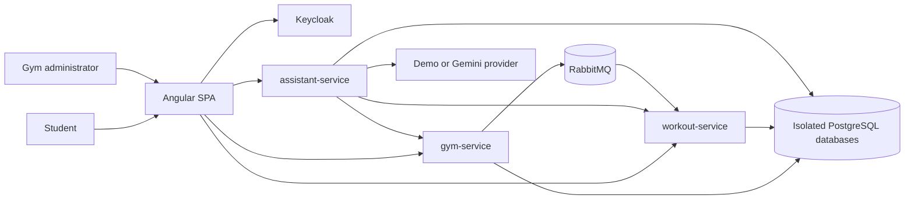
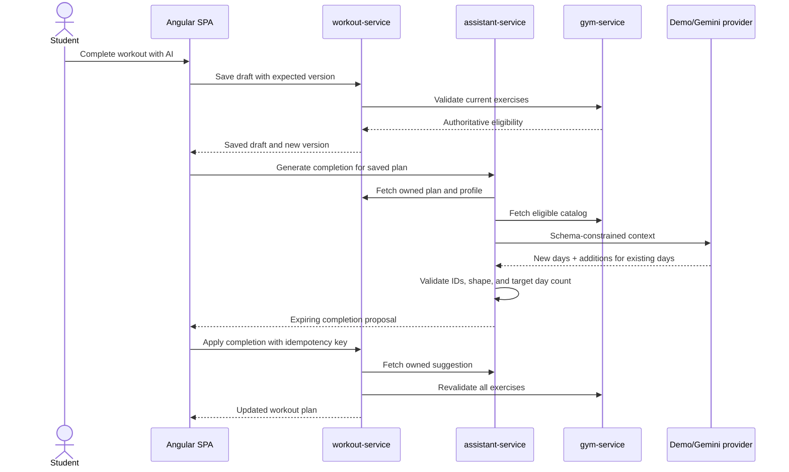
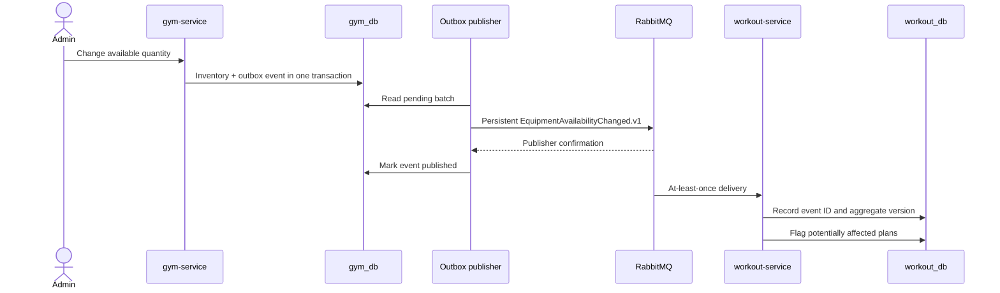

# Architecture

## System context

Each service owns its schema and credentials. Cross-service UUIDs are references, not shared entities, and are validated through APIs.

## Structured workout-completion flow

The browser never treats model output as authoritative. Only `workout-service` mutates the aggregate after ownership, version, idempotency, shape, and eligibility checks.

## Gemini trust boundary

Gemini is an optional adapter behind `TrainingAssistantProvider`; the deterministic demo adapter implements the same contract without an external call. The API key is injected only into `assistant-service` and sent in the server-side `x-goog-api-key` header. It is never placed in the Angular bundle, request body, tracked configuration, screenshots, or logs.

The external request contains a bounded JSON projection rather than database entities: the plan goal and target frequency, existing draft structure, the profile fields required to shape the week, and the exercise catalog already filtered for the selected branch. Context and any user-controlled strings are labelled as untrusted data. Gemini must return the configured JSON schema with `newDays` and `existingDayAdditions`; arbitrary exercise IDs, model-defined load, deletions, activation, and direct persistence are outside the contract.

Validation happens twice. `assistant-service` rejects malformed output, unknown exercise IDs, invalid day positions, incompatible exercise prescriptions, and a final day count that differs from the target. It persists only a short-lived proposal bound to the owner and plan version, plus a context fingerprint retained for audit. `workout-service` retrieves the proposal directly and again validates ownership, optimistic version, expiry, idempotency, structure, and live catalog eligibility before committing. Provider timeout, quota, refusal, or invalid output leaves the draft unchanged and manual editing available. The assistant status represents expiry only; single consumption is authoritative in `workout-service`.

## Inventory event flow

Retries are bounded and poison messages are dead-lettered. The event is a notification mechanism; synchronous REST validation remains authoritative before mutations.

## Failure boundaries

| Failure | Behavior |
| --- | --- |
| `gym-service` unavailable | Plans remain readable, but exercise mutations, activation, and suggestion application fail closed |
| AI provider unavailable | Manual workout editing remains available; no fallback from Gemini to demo occurs silently |
| AI provider returns malformed or ungrounded output | Proposal is rejected before persistence/application; the draft remains unchanged |
| Duplicate inventory event | Consumer transaction recognizes the event ID and produces no duplicate effect |
| Older aggregate version | Consumer ignores the stale inventory event |
| RabbitMQ unavailable | Inventory change commits with a pending outbox record and publication is retried |
| Concurrent plan update | Optimistic version validation returns `409 Conflict` |

Architectural choices and their consequences are recorded in [`docs/adr`](adr/README.md).
